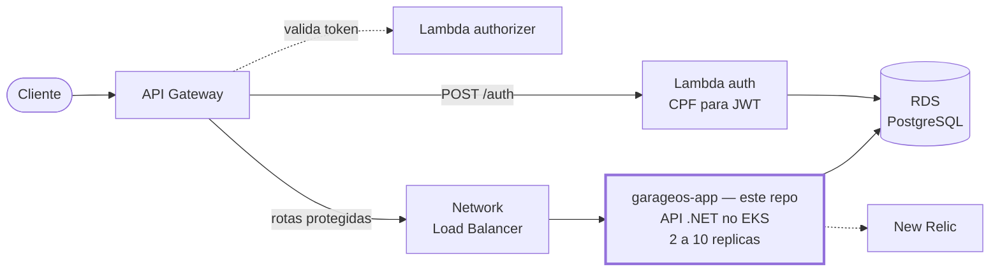
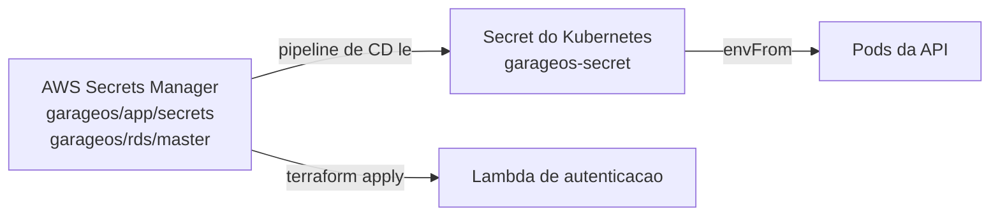

# GarageOS — Aplicação

Sistema de gestão para oficinas mecânicas — controle de clientes, veículos, serviços, estoque e ordens de serviço (OS), com fluxo completo de orçamento, execução e acompanhamento público pelo cliente.

Projeto desenvolvido como **Tech Challenge** da Pós-graduação em Arquitetura de Software.

> Este é o repositório da **aplicação**. A solução completa é composta por quatro repositórios — veja [Arquitetura da solução](#arquitetura-da-solução).

---

## Índice

- [Objetivo](#objetivo)
- [Stack](#stack)
- [Arquitetura da solução](#arquitetura-da-solução)
- [Documentação da API (Swagger)](#documentação-da-api-swagger)
- [Como rodar localmente](#como-rodar-localmente)
- [Como fazer o deploy na AWS](#como-fazer-o-deploy-na-aws)
- [Health checks](#health-checks)
- [Logs estruturados e observabilidade](#logs-estruturados-e-observabilidade)
- [Escalabilidade (HPA)](#escalabilidade-hpa)
- [Segredos](#segredos)
- [Testes e qualidade](#testes-e-qualidade)
- [Estrutura do repositório](#estrutura-do-repositório)
- [Documentação de arquitetura](#documentação-de-arquitetura)

---

## Objetivo

Entregar uma API REST que cubra a operação ponta a ponta de uma oficina:

- Cadastro de **clientes**, **veículos**, **serviços** e **itens de estoque**.
- Criação e gestão de **ordens de serviço**, com status, serviços executados e peças consumidas.
- Fluxo de **orçamento**: geração, envio ao cliente, aprovação ou recusa (com baixa de estoque na aprovação).
- **Acompanhamento público** da OS pelo cliente, pelo número da OS, sem login.
- **Aging** das OS para análise gerencial do tempo médio de execução.
- Autenticação **JWT** — administrativa na própria API, e por **CPF** via Lambda no API Gateway.

## Stack

| Camada | Tecnologia |
|---|---|
| Runtime | .NET 10 |
| API | ASP.NET Core Web API |
| ORM | Entity Framework Core |
| Banco | PostgreSQL 16 (Amazon RDS) |
| Validação | FluentValidation |
| Auth | JWT Bearer (HS256) |
| Logs | Serilog — JSON compacto com correlation ID |
| Observabilidade | New Relic — agente .NET (profiler do CLR), `nri-bundle` no cluster e custom events de negócio |
| Testes | xUnit, Moq, FluentAssertions, Testcontainers |
| Qualidade | SonarQube (Community) |
| Container | Docker + Docker Compose |
| Orquestração | Amazon EKS (Kubernetes) |
| CI/CD | GitHub Actions com OIDC |

Arquitetura de código: **Clean Architecture**, com separação em `Domain`, `Application`, `Infrastructure` e `Api`. As camadas externas dependem das internas, nunca o contrário.

---

## Arquitetura da solução



| Repositório | Responsabilidade |
|---|---|
| **`garageos-app`** *(este)* | API .NET, manifestos Kubernetes, imagem Docker e CI/CD da aplicação |
| [`garageos-infra-database`](https://github.com/TechChallengeFase1/garageos-infra-database) | RDS PostgreSQL e o `bootstrap/` (state remoto, OIDC, VPC, segredos compartilhados) |
| [`garageos-infra-k8s`](https://github.com/TechChallengeFase1/garageos-infra-k8s) | Cluster EKS, node group, Access Entries, namespace, `metrics-server` e `nri-bundle` |
| [`garageos-lambda-auth`](https://github.com/TechChallengeFase1/garageos-lambda-auth) | Lambda de autenticação por CPF e API Gateway HTTP API |

Diagrama completo, com VPC, subnets e fluxo de CI/CD: [docs/diagramas/componentes.md](docs/diagramas/componentes.md).

---

## Documentação da API (Swagger)

| Ambiente | URL |
|---|---|
| Local (Docker Compose) | <http://localhost:8080/swagger> |
| Cluster (via Load Balancer) | `http://<hostname-do-nlb>/swagger` |
| Através do API Gateway | `<api_gateway_url>/swagger` |

Para descobrir as URLs do ambiente provisionado:

```bash
kubectl get svc garageos-api -n garageos -o jsonpath='{.status.loadBalancer.ingress[0].hostname}'
```

```bash
terraform -chdir=../garageos-lambda-auth output -raw api_gateway_url
```

Também há uma coleção Postman pronta para importar: [Code/Postman/GarageOS.postman_collection.json](Code/Postman/GarageOS.postman_collection.json).

### Principais rotas

| Método | Rota | Auth | Descrição |
|---|---|---|---|
| `POST` | `/auth` *(no API Gateway)* | pública | Autenticação do cliente por CPF, devolve JWT |
| `POST` | `/api/Auth/login` | pública | Login administrativo (usuário e senha) |
| `POST` | `/api/OrdensDeServico/abertura-completa` | JWT | Abre a OS com serviços e peças |
| `POST` | `/api/OrdensDeServico/{id}/orcamento` | JWT | Gera o orçamento |
| `POST` | `/api/OrdensDeServico/{id}/orcamento/enviar` | JWT | Envia ao cliente (`AguardandoAprovacao`) |
| `PATCH` | `/api/OrdensDeServico/{id}/orcamento/resposta` | pública | Aprovação ou recusa pelo cliente |
| `PATCH` | `/api/OrdensDeServico/{id}/status` | JWT | Altera o status da OS |
| `GET` | `/api/OrdensDeServico/aging` | JWT | Tempo médio por status |
| `GET` | `/api/OrdensDeServico/acompanhar/{numeroOS}` | pública | Acompanhamento pelo cliente |
| `GET` | `/health/live` · `/health/ready` | pública | Health checks |

Há ainda os CRUDs de `Clientes`, `Veiculos`, `Servicos` e `Estoques`, todos protegidos por JWT.

---

## Como rodar localmente

Pré-requisitos: Docker e Docker Compose. SDK .NET 10 e `dotnet-ef` apenas se quiser rodar comandos `dotnet` fora do container.

**1. Configurar as variáveis de ambiente**

```bash
cp .env.example .env
```

Preencha ao menos `POSTGRES_*`, `JWT_*` e `ADMIN_*`. As variáveis `NEW_RELIC_*` são opcionais no local — sem elas o agente simplesmente não envia telemetria.

**2. Subir os containers**

```bash
docker compose up -d --build
```

| Serviço | Porta | Descrição |
|---|---|---|
| `garageos-api` | **8080** | API GarageOS |
| `garageos-postgres` | 5432 | Banco principal |
| `garageos-pgadmin` | 5050 | Interface web do Postgres |
| `garageos-sonarqube` | 9000 | Análise de qualidade (opcional) |
| `garageos-sonar-db` | — | Banco do SonarQube |

No Compose, `Database__MigrateOnStartup=true` faz a API aplicar as migrations ao subir — há uma instância só, então é seguro e conveniente. **No cluster isso fica desligado**: quem migra é um Job (ver [Migrations](#migrations)).

**3. Acessar**

- API: <http://localhost:8080>
- **Swagger**: <http://localhost:8080/swagger>
- PgAdmin: <http://localhost:5050>
- SonarQube: <http://localhost:9000>

**4. Autenticar**

```bash
curl -X POST http://localhost:8080/api/Auth/login \
  -H "content-type: application/json" \
  -d '{"username":"admin","password":"<ADMIN_PASSWORD do .env>"}'
```

Use o token nas rotas protegidas com `Authorization: Bearer <token>`.

**5. Encerrar**

```bash
docker compose down
```

Acrescente `-v` para remover também os volumes (zera o banco).

### Acessar o banco da nuvem a partir da máquina

O RDS está em subnet privada com `publicly_accessible = false` — não existe rota da internet até ele, e isso é proposital. Para usar DBeaver, pgAdmin ou `psql`, há um túnel pronto:

```bash
./scripts/tunel-banco.sh
```

Ele sobe um pod `socat` no cluster, que herda o Security Group "crachá" dos nós, e encaminha `localhost:5432` até o RDS.

---

## Como fazer o deploy na AWS

### Pré-requisitos de infraestrutura

O deploy depende da infraestrutura já provisionada, **nesta ordem**:

```text
bootstrap/  →  garageos-infra-database  →  garageos-infra-k8s  →  garageos-app  →  garageos-lambda-auth
```

Se algum passo anterior faltar, a pipeline falha ao procurar os parâmetros no SSM — antes de tocar em qualquer coisa.

### Deploy automático (caminho normal)

Todo push na `main` dispara `.github/workflows/cd.yml`:

| Etapa | O que faz |
|---|---|
| Build e testes | `dotnet build`, testes unitários e de integração |
| Imagem Docker | Build e push para o Docker Hub: `:latest` e `:{sha}` |
| Autenticação na AWS | **OIDC** — nenhuma credencial estática existe neste repositório |
| Descoberta | Lê cluster, namespace e ARNs dos segredos no SSM Parameter Store |
| Secret | Lê o Secrets Manager e cria/atualiza o Secret do Kubernetes |
| Migrations | Aplica o Job e **aguarda concluir** antes do rollout |
| Deploy | `kubectl apply -f k8s/` + `rollout status` |
| Smoke test | `curl` em `/health/ready` pelo Load Balancer |

O deploy usa o environment `producao` do GitHub — configurar *required reviewers* ali faz o deploy aguardar aprovação em vez de disparar sozinho.

Nada do que o workflow precisa está escrito à mão nele: recriar a infraestrutura do zero **não exige editar este arquivo**. Ver [ADR 0001](docs/adrs/0001-comunicacao-entre-repositorios.md).

### Deploy manual (para diagnóstico)

```bash
aws eks update-kubeconfig --name "$(aws ssm get-parameter --name /garageos/producao/eks/cluster-name --query Parameter.Value --output text)" --region us-east-1
```

```bash
kubectl apply -f k8s/ -n garageos
```

```bash
kubectl rollout status deployment/garageos-api -n garageos --timeout=300s
```

### Migrations

As migrations rodam em um **Kubernetes Job** (`k8s/jobs/migrations-job.yaml`), com a mesma imagem da API e `args: ["--migrate"]`.

Não é preferência de estilo: com o HPA ativo, várias réplicas sobem ao mesmo tempo e, se as migrations estivessem no startup, todas tentariam migrar em paralelo, disputando a mesma tabela de histórico do EF Core. O Job roda **uma vez**, antes do rollout.

```bash
kubectl delete job garageos-migrations -n garageos --ignore-not-found
kubectl apply -f k8s/jobs/migrations-job.yaml
kubectl wait --for=condition=complete job/garageos-migrations -n garageos --timeout=300s
```

> `kubectl apply -f k8s/` **não é recursivo** — por isso o Job fica em `k8s/jobs/` e não é reaplicado junto com os manifestos da API.

---

## Health checks

| Endpoint | Consulta o banco? | Usado por |
|---|---|---|
| `/health/live` | **Não** | `livenessProbe` — reinicia o container se travar |
| `/health/ready` | **Sim** | `readinessProbe` — tira o pod do balanceamento |

A separação é deliberada. Se o liveness consultasse o banco, uma oscilação do RDS reprovaria a probe em **todos** os pods ao mesmo tempo e o Kubernetes mataria a aplicação inteira — transformando instabilidade de banco em queda total. Com a divisão atual, o pod apenas sai do balanceamento e volta sozinho quando o banco voltar.

---

## Logs estruturados e observabilidade

Os logs saem em **JSON compacto** (Serilog + `CompactJsonFormatter`) no stdout, que é de onde o Kubernetes e o agente do New Relic coletam.

O `CorrelationIdMiddleware`:

- aceita o header `X-Correlation-Id` do chamador, ou gera um novo;
- publica o valor no `LogContext` do Serilog, então **toda** linha de log da requisição o carrega;
- devolve o header na resposta, para o chamador correlacionar do lado dele.

O agente do New Relic injeta `trace.id` e `span.id` em cada linha, ligando log a trace na interface. Dado um `X-Correlation-Id`, é possível recuperar todas as linhas da requisição e o trace com as consultas SQL que ela executou.

### Métricas de negócio

Latência e taxa de erro o agente coleta sozinho. O que ele **não** tem como saber é quantas OS foram abertas hoje ou quanto tempo uma OS ficou em diagnóstico — isso é dado do domínio, e só a aplicação pode emitir.

A publicação passa pela interface `IMetricasDeNegocio` (`GarageOS.Application/Abstractions`), implementada por `MetricasNewRelic` na Infrastructure. Os use cases não conhecem o fornecedor.

| Evento | Atributos | Emitido em |
|---|---|---|
| `OrdemDeServicoCriada` | `numeroOS`, `clienteId` | `AbrirOrdemDeServicoCompletaUseCase`, após persistir |
| `OrdemDeServicoStatus` | `numeroOS`, `statusAnterior`, `statusNovo`, `minutosNoStatus` | `AlterarStatusOrdemDeServicoUseCase` |
| `OrdemDeServicoFalha` | `numeroOS`, `motivo` | Falhas no processamento de uma ordem de serviço |

Duas garantias que valem conhecer antes de mexer:

- **`minutosNoStatus` é calculado antes da transição.** Depois de `AlterarStatus()`, o estado anterior não existe mais em lugar nenhum.
- **Telemetria nunca derruba operação.** Nenhuma chamada de métrica propaga exceção: falha vira `LogDebug` e a OS segue. É o que permite rodar localmente, sem agente, sem tratamento especial.

As NRQL dos dashboards e a condição do alerta estão registradas na [RFC 0004](docs/rfcs/0004-ferramenta-de-observabilidade.md) — eles vivem na interface do New Relic, não em código, então essa RFC é a referência para reconstruí-los.

Detalhes e critérios de escolha da ferramenta: [RFC 0004](docs/rfcs/0004-ferramenta-de-observabilidade.md).

---

## Escalabilidade (HPA)

`k8s/hpa.yaml` mantém entre **2 e 10 réplicas**, com alvo de **70% de CPU**.

Para o HPA funcionar de fato, quatro condições precisam estar satisfeitas:

1. `metrics-server` instalado no cluster (feito pelo `garageos-infra-k8s`);
2. `resources.requests.cpu` declarado no Deployment — sem denominador não há percentual;
3. migrations fora do startup;
4. health checks HTTP corretos, para o Service só mandar tráfego a pods prontos.

```bash
kubectl get hpa -n garageos
kubectl top pods -n garageos
```

Racional completo e limites conhecidos: [ADR 0002](docs/adrs/0002-uso-do-hpa.md).

---

## Segredos

**Nenhum segredo está versionado neste repositório.** O antigo `k8s/secret.yaml`, que trazia a `JWT_SECRET_KEY` em Base64, foi removido.



A pipeline lê o Secrets Manager em tempo de deploy e cria o Secret do Kubernetes de forma idempotente. A `JWT_SECRET_KEY` é a **mesma** usada pela Lambda de autenticação — as duas leem do mesmo segredo, e é isso que impede o modo de falha em que a API rejeita silenciosamente todo token emitido pela Lambda.

| Chave no Secret do Kubernetes | Origem |
|---|---|
| `ConnectionStrings__DefaultConnection` | `garageos/rds/master` → `connectionString` |
| `Jwt__SecretKey` | `garageos/app/secrets` → `jwtSecretKey` |
| `Admin__Password` | `garageos/app/secrets` → `adminPassword` |
| `NEW_RELIC_LICENSE_KEY` | `garageos/app/secrets` → `newRelicLicenseKey` |

Todos os valores passam por `::add-mask::` antes de qualquer uso, então um comando que os ecoe por engano sai mascarado no log.

O `ConfigMap` (`k8s/configmap.yaml`) guarda apenas configuração **não sensível**: ambiente, issuer, audience, usuário admin e `NEW_RELIC_APP_NAME` (`garageOS`) — nome distinto do usado no `docker compose` local, para que os dados de desenvolvimento não se misturem aos do cluster.

> A license key é o único segredo que **não é sorteado** pelo Terraform: é emitida pela New Relic e entra uma vez, como variável do bootstrap. Se ficar vazia, o agente sobe, se desliga e a aplicação funciona normalmente — só não reporta nada.

---

## Testes e qualidade

```bash
dotnet test Code/GarageOS.UnitTests/GarageOS.UnitTests.csproj
```

```bash
dotnet test Code/GarageOS.IntegrationTests/GarageOS.IntegrationTests.csproj
```

Os testes de integração sobem um PostgreSQL real via **Testcontainers**, então o Docker precisa estar em execução.

Análise SonarQube (com o Compose no ar):

```bash
cd Code && ./sonar-scan.sh
```

No Windows, use `./sonar-scan.ps1`. Requer `dotnet-sonarscanner` como ferramenta global e `SONAR_TOKEN` preenchido no `.env`.

---

## Estrutura do repositório

```text
garageos-app/
├── .github/workflows/       # ci.yml (build + testes) e cd.yml (imagem + deploy no EKS)
├── Code/
│   ├── GarageOS.Api/            # Controllers, middlewares, health checks, Program.cs
│   ├── GarageOS.Application/    # Use cases, DTOs, validators
│   ├── GarageOS.Domain/         # Entidades, value objects, regras de domínio
│   ├── GarageOS.Infrastructure/ # EF Core, repositórios, migrations
│   ├── GarageOS.UnitTests/
│   ├── GarageOS.IntegrationTests/
│   └── Postman/                 # Coleção pronta para importar
├── docs/
│   ├── rfcs/                # Decisões de tecnologia
│   ├── adrs/                # Decisões de arquitetura
│   └── diagramas/           # Componentes, sequência e ER
├── k8s/
│   ├── api-deployment.yaml  # Deployment com probes HTTP
│   ├── api-service.yaml     # Service type LoadBalancer (NLB)
│   ├── configmap.yaml       # Configuração não sensível
│   ├── hpa.yaml             # 2 a 10 réplicas, CPU 70%
│   └── jobs/                # Job de migrations
├── scripts/                 # Túnel para o RDS, validação da solução
├── Dockerfile               # Multi-stage + agente do New Relic
└── docker-compose.yml
```

---

## Documentação de arquitetura

Índice completo em **[docs/README.md](docs/README.md)**.

| Documento | Assunto |
|---|---|
| [RFC 0001](docs/rfcs/0001-escolha-provedor-cloud.md) | Escolha do provedor de nuvem (AWS) |
| [RFC 0002](docs/rfcs/0002-escolha-banco-de-dados.md) | Escolha do banco de dados (RDS PostgreSQL) |
| [RFC 0003](docs/rfcs/0003-estrategia-de-autenticacao.md) | Estratégia de autenticação (CPF, Lambda, JWT) |
| [RFC 0004](docs/rfcs/0004-ferramenta-de-observabilidade.md) | Ferramenta de observabilidade (New Relic) |
| [ADR 0001](docs/adrs/0001-comunicacao-entre-repositorios.md) | Comunicação entre os repositórios |
| [ADR 0002](docs/adrs/0002-uso-do-hpa.md) | Uso do HPA |
| [Componentes](docs/diagramas/componentes.md) · [Autenticação](docs/diagramas/sequencia-autenticacao.md) · [Abertura de OS](docs/diagramas/sequencia-abertura-os.md) · [ER](docs/diagramas/modelo-er.md) | Diagramas |

Imagem pública no Docker Hub: [`garageosfiap/garageos-api`](https://hub.docker.com/r/garageosfiap/garageos-api).

---

## Autores

Trabalho desenvolvido pelo grupo da Pós-graduação em Arquitetura de Software.
