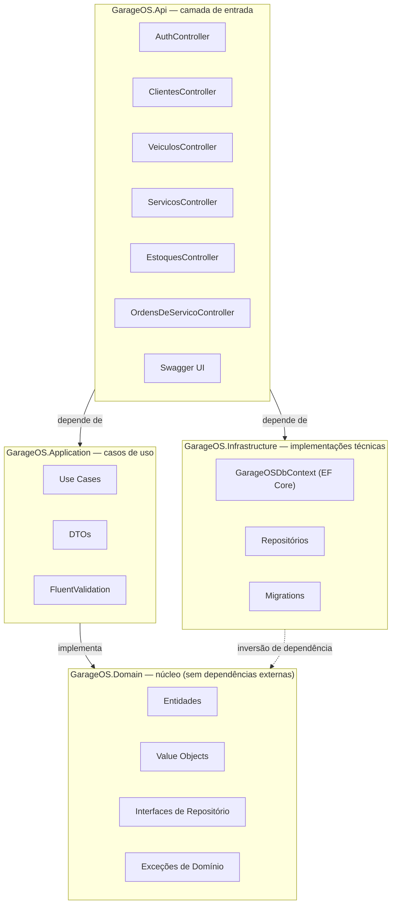
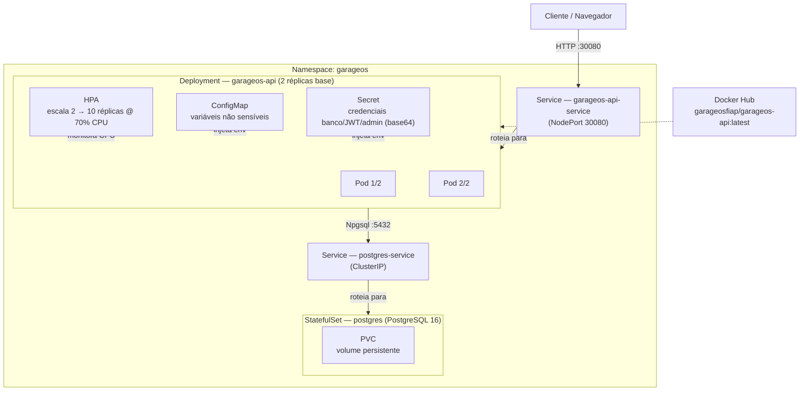

# GarageOS — Desenho da Arquitetura Proposta

Componentes da aplicação (Clean Architecture) e infraestrutura provisionada (Kubernetes) para a API de gestão de oficina automotiva.

> Branch `main` · Runtime .NET 10 / ASP.NET Core · Banco PostgreSQL 16 · Orquestração Kubernetes

---

## 1. Componentes da Aplicação

Estrutura em Clean Architecture: as camadas externas dependem das internas, nunca o contrário
(`Api → Application / Infrastructure → Domain`). O `Domain` não conhece nenhuma das demais camadas.

**Cobertura de testes**

| Projeto | Arquivos | Ferramentas | Cobre |
|---|---|---|---|
| `GarageOS.UnitTests` | 49 | xUnit + Moq | Use Cases, Validators, Domain |
| `GarageOS.IntegrationTests` | 9 | Testcontainers | Controllers e Repositórios contra Postgres real |

---

## 2. Infraestrutura Provisionada

Produção roda em um cluster Kubernetes: a imagem publicada no Docker Hub é implantada como Deployment com
autoscaling, exposta via Service NodePort, e persiste dados em um StatefulSet PostgreSQL com volume dedicado.

**Legenda**: seta sólida = fluxo de requisição/dados · seta tracejada = configuração, montagem ou pull externo.

---

## Observações

- Ambiente local de desenvolvimento usa `docker-compose.yml` (postgres, pgadmin, api, sonarqube-db, sonarqube) em vez do cluster K8s — não representado aqui por ser um ambiente à parte.
- As probes do Deployment são TCP puras porque a API ainda não expõe um endpoint `/health`; um readiness/liveness HTTP traria diagnóstico mais preciso.
- O Secret do K8s guarda os valores em base64 (não criptografado) — considerar um cofre externo (ex. Sealed Secrets, Vault) antes de expor o repositório publicamente.
