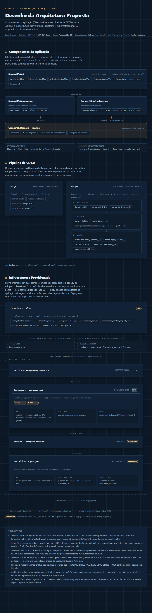
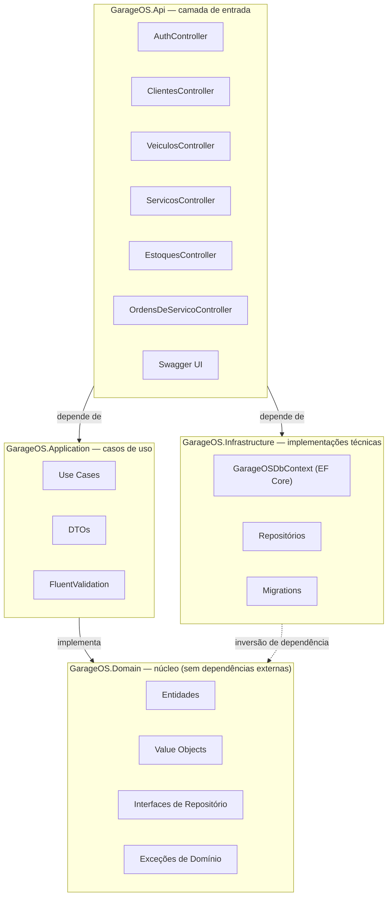
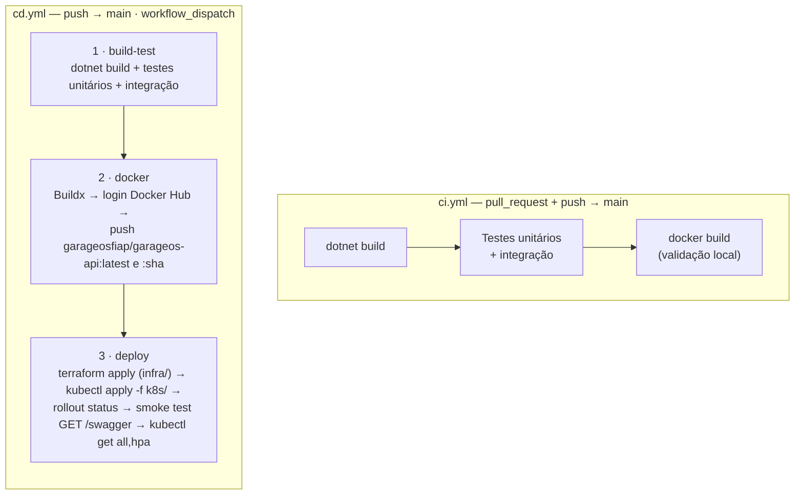
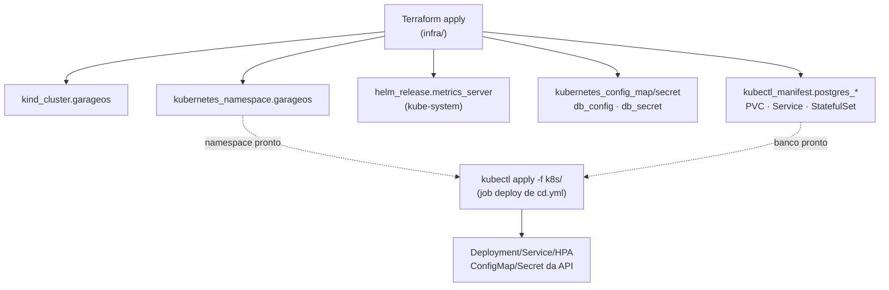
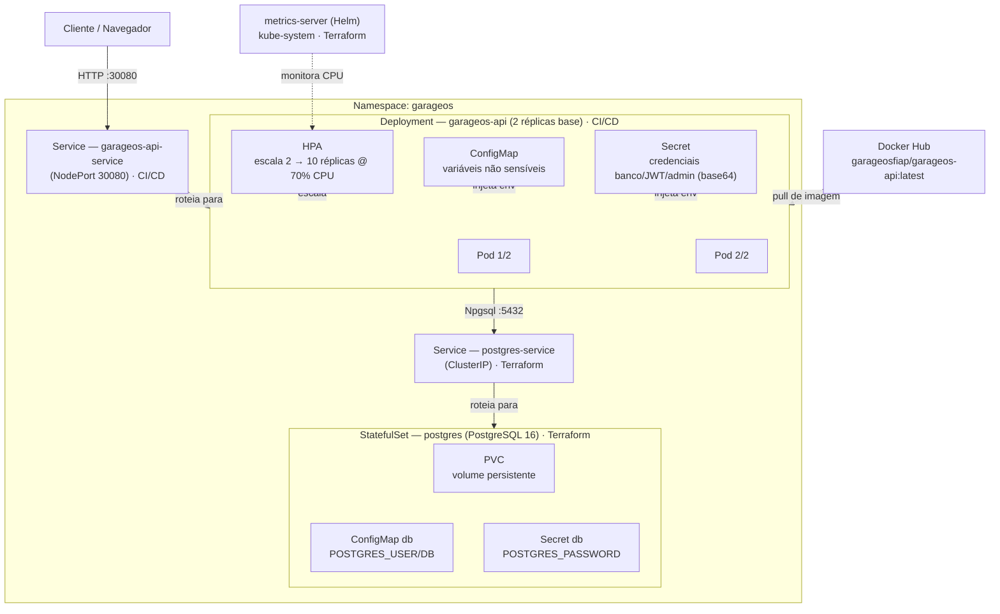

# GarageOS — Desenho da Arquitetura Proposta

Componentes da aplicação (Clean Architecture), pipeline de CI/CD (GitHub Actions) e infraestrutura provisionada (Terraform + Kubernetes) para a API de gestão de oficina automotiva.

> Branch `main` · Runtime .NET 10 / ASP.NET Core · Banco PostgreSQL 16 · Orquestração Kubernetes (kind) · IaC Terraform · CI/CD GitHub Actions

---

## 1. Componentes da Aplicação

Estrutura em Clean Architecture: as camadas externas dependem das internas, nunca o contrário
(`Api → Application / Infrastructure → Domain`). O `Domain` não conhece nenhuma das demais camadas.

**Cobertura de testes**

| Projeto | Arquivos | Ferramentas | Cobre |
|---|---|---|---|
| `GarageOS.UnitTests` | 49 | xUnit + Moq | Use Cases, Validators, Domain |
| `GarageOS.IntegrationTests` | 9 | Testcontainers | Controllers e Repositórios contra Postgres real |

---

## 2. Pipeline de CI/CD

Dois workflows em `.github/workflows/`: `ci.yml` valida pull requests e pushes; `cd.yml` roda no push para `main`
(ou `workflow_dispatch`) e executa a entrega completa — build, testes, imagem, provisionamento via Terraform e
aplicação dos manifestos. `cd.yml` usa `concurrency` para cancelar runs anteriores em andamento no mesmo ref.

> O job `deploy` de `cd.yml` é quem executa, em sequência, o `terraform apply` e o `kubectl apply -f k8s/`
> detalhados nas seções 3 e 4 — hoje esse fluxo é 100% automatizado, sem etapas manuais.

---

## 3. Infraestrutura como Código (Terraform)

O diretório `infra/` provisiona, via Terraform, a **base** do ambiente: cluster Kubernetes, namespace, metrics-server
e banco de dados. A aplicação em si (Deployment/Service/HPA/ConfigMap/Secret da API) **não** é provisionada pelo
Terraform — ela é aplicada a partir de `k8s/` via `kubectl apply` pela pipeline de CI/CD. Todos os recursos são
declarados como resources de verdade (`kind_cluster`, `kubernetes_*`, `helm_release`, `kubectl_manifest`), sem
`local-exec`.

| Arquivo | Recurso Terraform | Provisiona |
|---|---|---|
| `cluster.tf` | `kind_cluster.garageos` | Cluster Kubernetes local (kind), NodePort 30080 mapeado para `localhost` via `extra_port_mappings` |
| `namespace.tf` | `kubernetes_namespace.garageos` | Namespace `garageos` |
| `metrics-server.tf` | `helm_release.metrics_server` | metrics-server via Helm, em `kube-system` (necessário para o HPA ler CPU) |
| `database.tf` | `kubernetes_config_map.db_config`, `kubernetes_secret.db_secret` | Config/credenciais do Postgres (`POSTGRES_USER`, `POSTGRES_DB`, `POSTGRES_PASSWORD`) |
| `database.tf` | `kubectl_manifest.postgres_*` | PVC, Service e StatefulSet do Postgres (reaproveita YAMLs de `infra/manifests/`) |

---

## 4. Infraestrutura Provisionada (Kubernetes)

Produção roda no cluster kind criado pelo Terraform: a imagem publicada no Docker Hub é implantada como Deployment com
autoscaling, exposta via Service NodePort, e persiste dados em um StatefulSet PostgreSQL com volume dedicado.

**Legenda**: seta sólida = fluxo de requisição/dados · seta tracejada = configuração, montagem, pull externo ou monitoramento.
Os rótulos **Terraform** / **CI/CD** em cada objeto indicam quem o provisiona (ver seções 2 e 3).

---

## Observações

- O cluster é um `kind` (Kubernetes-in-Docker) local, não um provedor cloud — adequado ao escopo do curso; os módulos Terraform (providers `kubernetes`/`helm`/`kubectl`) portariam para EKS/AKS/GKE trocando principalmente `cluster.tf`.
- A divisão de responsabilidade é explícita e hoje 100% automatizada: o job `deploy` de `cd.yml` roda `terraform apply` (base) e depois `kubectl apply -f k8s/` (aplicação) a cada push em `main` — sem etapas manuais.
- Como `cd.yml` roda `terraform apply` a cada push, o runner do GitHub Actions recria o cluster `kind` do zero em cada execução — não há cluster persistente entre runs; mantém o pipeline idempotente, mas custa tempo de build.
- O smoke test do job `deploy` faz `curl` em `/swagger/index.html` como proxy de saúde, já que a API ainda não expõe um endpoint `/health` dedicado — a mesma lacuna que faz as probes do Deployment serem TCP puras.
- Publicar a imagem no Docker Hub (job `docker`) depende dos secrets `DOCKERHUB_USERNAME` e `DOCKERHUB_TOKEN` configurados no repositório GitHub.
- Ambiente local de desenvolvimento também pode usar `docker-compose.yml` (postgres, pgadmin, api, sonarqube-db, sonarqube) como alternativa ao cluster K8s — não representado aqui por ser um ambiente à parte.
- Os Secrets (app e banco) guardam os valores em base64 (não criptografado) — considerar um cofre externo (ex. Sealed Secrets, Vault) antes de expor o repositório publicamente.
