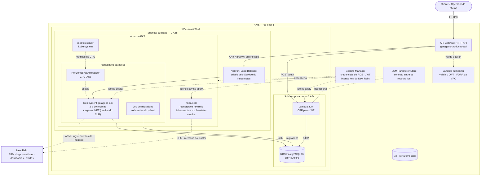
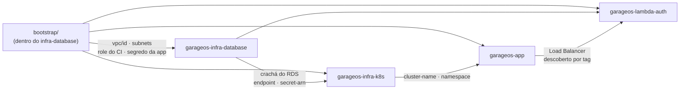
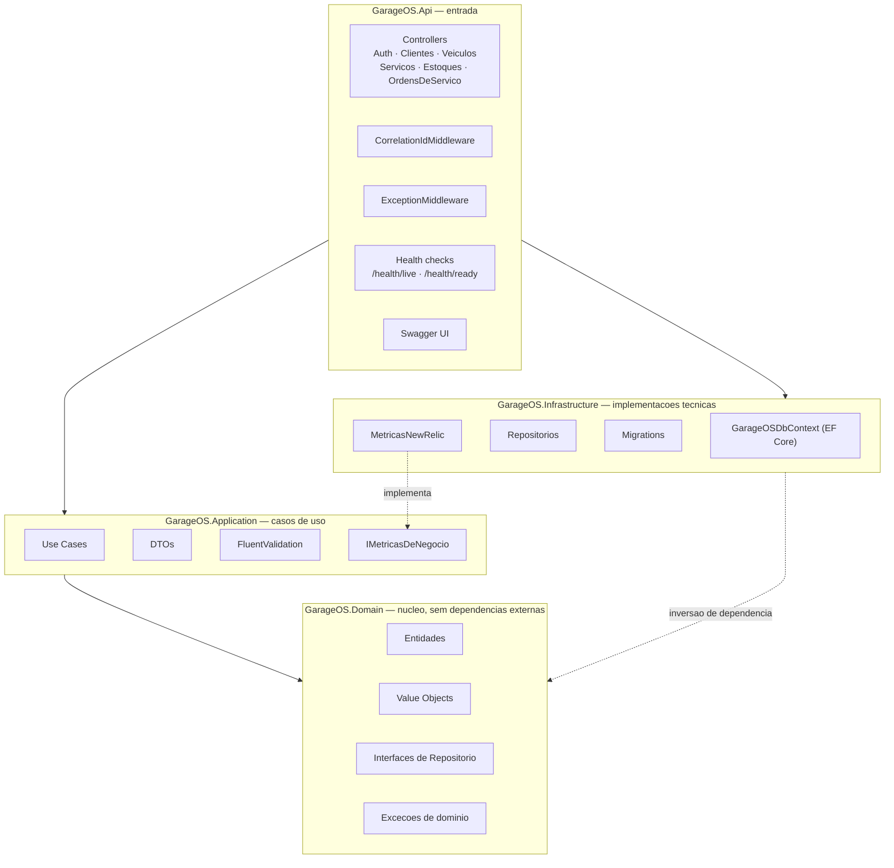

# Diagrama de Componentes — GarageOS

Visão dos componentes provisionados na AWS, de quem os provisiona e de como conversam entre si.

> Região `us-east-1` · 2 zonas de disponibilidade · 4 repositórios, 4 states do Terraform

---

## 1. Componentes da solução

**Leitura rápida**

- A **porta de entrada** é o API Gateway. `POST /auth` é público; todo o resto passa pelo Lambda authorizer antes de chegar ao cluster.
  Uma ressalva que o desenho não mostra: o NLB é `internet-facing` e continua alcançável diretamente, então o gateway é ponto de controle **preferencial, não fronteira obrigatória**. A API valida o mesmo token por conta própria — ver [ADR 0003](../adrs/0003-exposicao-do-load-balancer.md).
- O **banco fica nas subnets privadas**, sem rota para a internet. Só alcançam a porta 5432 os recursos que carregam o Security Group "crachá": os nós do EKS e a Lambda de autenticação.
- Os **nós ficam nas subnets públicas** porque não há NAT Gateway (economia de ~US$ 32/mês). Eles têm IP público protegido por Security Group, sem nenhuma porta aberta para `0.0.0.0/0`.
- **Nenhum segredo está no Git.** O Secrets Manager é a fonte da verdade; a pipeline o lê no deploy e cria o Secret do Kubernetes.
- **A observabilidade tem dois agentes.** O do CLR, dentro dos pods, reporta APM, logs e os eventos de negócio; o `nri-bundle`, em namespace próprio, reporta CPU e memória do cluster. Os dois usam a mesma license key.

---

## 2. Repositórios e responsabilidades

| Repositório | Provisiona / entrega | State |
|---|---|---|
| `bootstrap/` | Bucket S3 do state, OIDC + IAM Role do GitHub Actions, VPC, subnets, IGW, rotas, segredo compartilhado da aplicação | `bootstrap/terraform.tfstate` |
| `garageos-infra-database` | RDS PostgreSQL, DB Subnet Group, Security Groups, senha no Secrets Manager, parâmetros no SSM | `database/terraform.tfstate` |
| `garageos-infra-k8s` | Cluster EKS, node group, Access Entries, namespace, `metrics-server`, `nri-bundle` | `k8s/terraform.tfstate` |
| `garageos-app` | Imagem Docker, Deployment, Service, ConfigMap, Secret, HPA e Job de migrations | — (manifestos aplicados por `kubectl`) |
| `garageos-lambda-auth` | Lambda de autenticação, Lambda authorizer, API Gateway HTTP API, rotas e stage | `lambda/terraform.tfstate` |

A ordem das setas é a **ordem obrigatória de aplicação**. Se um repositório anterior não tiver sido aplicado, o `terraform plan` do seguinte falha com `ParameterNotFound` — antes de criar qualquer coisa. Ver [ADR 0001](../adrs/0001-comunicacao-entre-repositorios.md).

---

## 3. Camadas da aplicação

Clean Architecture: as camadas externas dependem das internas, nunca o contrário.

---

## 4. Fluxo de CI/CD

```mermaid
flowchart LR
    PR["Pull Request"] --> CI["CI: build + testes<br/>unitarios e integracao"]
    CI --> MERGE["Merge na main"]
    MERGE --> BT["Build e testes"]
    BT --> IMG["Imagem Docker<br/>tag = SHA do commit"]
    IMG --> OIDC["Autenticacao na AWS<br/>via OIDC, sem chave estatica"]
    OIDC --> DESC["Descobrir cluster e<br/>segredos no SSM"]
    DESC --> SEC["Criar Secret do Kubernetes<br/>a partir do Secrets Manager"]
    SEC --> MIG["Job de migrations<br/>aguarda concluir"]
    MIG --> ROLL["kubectl apply + rollout"]
    ROLL --> SMOKE["Smoke test em<br/>/health/ready"]
```

Nas raízes Terraform, a estratégia é a mesma nos três repositórios de infraestrutura:

| Gatilho | Ação |
|---|---|
| Pull Request | `fmt` + `validate` + `plan`. Nunca aplica |
| Push em `homolog` | `apply` no workspace `homolog` |
| Push em `main` | `apply` no workspace `producao` |
| `workflow_dispatch` | `plan`, `apply` ou `destroy` no ambiente escolhido |

---

## Documentos relacionados

- [Diagrama de sequência — autenticação](sequencia-autenticacao.md)
- [Diagrama de sequência — abertura de OS](sequencia-abertura-os.md)
- [Diagrama ER](modelo-er.md)
- [RFCs e ADRs](../README.md)
