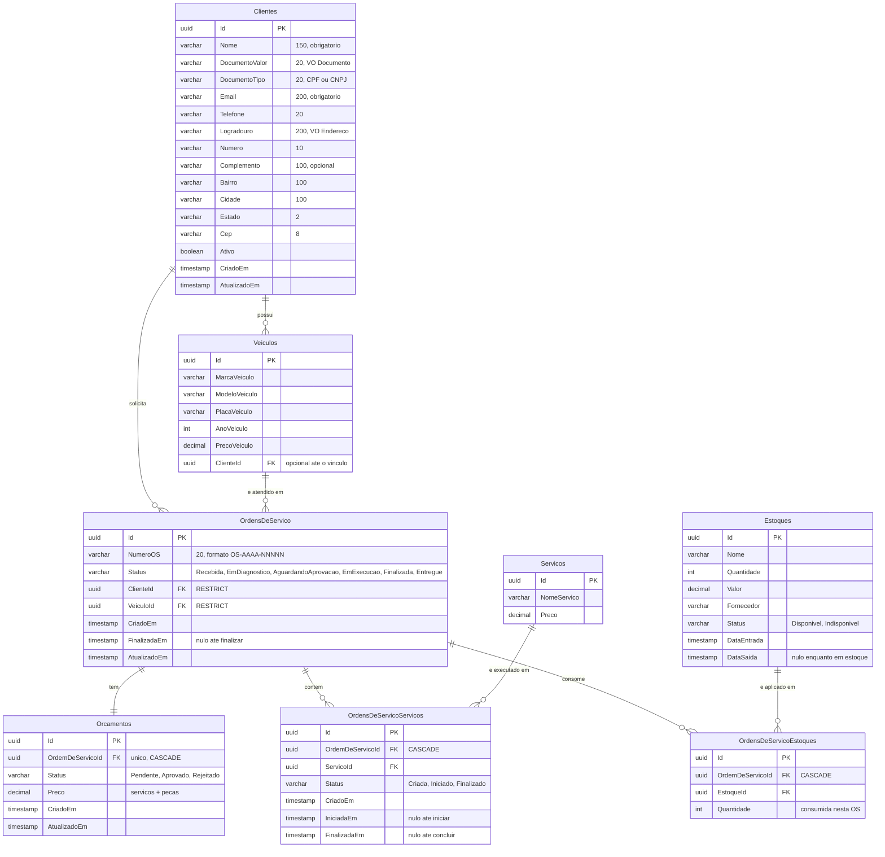

# Diagrama ER — Modelo de Dados

Modelo relacional do GarageOS no **Amazon RDS for PostgreSQL 16**, gerado pelas migrations do Entity Framework Core.

A justificativa da escolha do banco está em [RFC 0002 — Escolha do Banco de Dados](../rfcs/0002-escolha-banco-de-dados.md); um resumo dela fecha este documento.

---

## Diagrama



---

## Decisões de modelagem

### Value Objects como colunas da mesma tabela

`Documento` e `Endereco` são *owned types* do EF Core: ficam gravados em `Clientes`, sem tabela nem FK própria. A validação (CPF/CNPJ, formato do CEP) mora no value object, no domínio — o banco guarda o resultado já validado.

A coluna `DocumentoValor` é a que a **Lambda de autenticação** consulta:

```sql
SELECT "Id", "Nome", "Email", "Ativo"
FROM "Clientes"
WHERE "DocumentoValor" = $1
LIMIT 1
```

> O valor é gravado **somente com dígitos**. A Lambda normaliza a entrada (`123.456.789-09` → `12345678909`) antes de consultar.

### Tabelas de ligação com estado próprio

`OrdensDeServicoServicos` e `OrdensDeServicoEstoques` não são tabelas N:N puras: cada linha carrega dados que só existem naquele vínculo.

- Um **item de serviço** tem status e tempos de início e fim próprios. O mesmo serviço de catálogo ("troca de óleo") tem execuções independentes em OS diferentes.
- Um **item de estoque** carrega a quantidade consumida naquela OS.

É esse estado por vínculo que torna a modelagem relacional natural aqui — e que ficaria desnormalizado à mão em um banco de documentos.

### Comportamento de exclusão

| Relação | Regra | Motivo |
|---|---|---|
| OS → Cliente | `RESTRICT` | Não se apaga um cliente que tem histórico de atendimento |
| OS → Veículo | `RESTRICT` | Mesma razão |
| OS → Orçamento | `CASCADE` | Orçamento não existe fora da OS |
| OS → itens de serviço | `CASCADE` | Idem |
| OS → itens de estoque | `CASCADE` | Idem |

### Consultas que o modelo precisa servir

| Necessidade | Como o modelo atende |
|---|---|
| Autenticação por CPF | Busca direta em `Clientes.DocumentoValor` |
| Numeração sequencial `OS-2026-00042` | Maior sequencial do ano em `OrdensDeServico.NumeroOS` |
| Aging / tempo médio por status | `AVG` sobre `FinalizadaEm - IniciadaEm` em `OrdensDeServicoServicos`, agrupado por status |
| Volume diário de OS | `COUNT` por `date_trunc('day', "CriadoEm")` |
| Acompanhamento público | `NumeroOS` + itens de serviço com status |

As três últimas alimentam os dashboards de negócio da Fase 6.

---

## Por que PostgreSQL (resumo)

Versão curta da [RFC 0002](../rfcs/0002-escolha-banco-de-dados.md):

1. **O domínio é relacional.** Toda regra do negócio é uma relação com restrição: OS pertence a cliente e a veículo, item de serviço só existe dentro de uma OS, baixa de estoque está amarrada à peça consumida. Em um banco relacional essas restrições são declarativas e verificadas pelo próprio SGBD, em vez de dependerem de disciplina no código.

2. **As consultas do negócio são agregações.** Aging, tempo médio por status e volume diário de OS são `GROUP BY` com `AVG` e `COUNT` sobre timestamps. É o que SQL faz melhor; em um banco de documentos viraria *scan* com agregação em memória.

3. **Open source, sem custo de licença, e já conhecido pela equipe.** O PostgreSQL é o banco do projeto desde a Fase 1 — migrations, mappings e testes de integração com Testcontainers já existem e continuam válidos. A migração para a nuvem trocou apenas *onde* ele roda, não *o que* ele é.

4. **Gerenciado pela AWS, dentro do orçamento.** `db.t4g.micro` é elegível ao free tier; o Aurora Serverless v2 custaria ~US$ 43/mês só para ficar ligado, quase metade do crédito disponível.

---

## Documentos relacionados

- [RFC 0002 — Escolha do Banco de Dados](../rfcs/0002-escolha-banco-de-dados.md)
- [Diagrama de sequência — abertura de OS](sequencia-abertura-os.md)
- [Diagrama de componentes](componentes.md)
