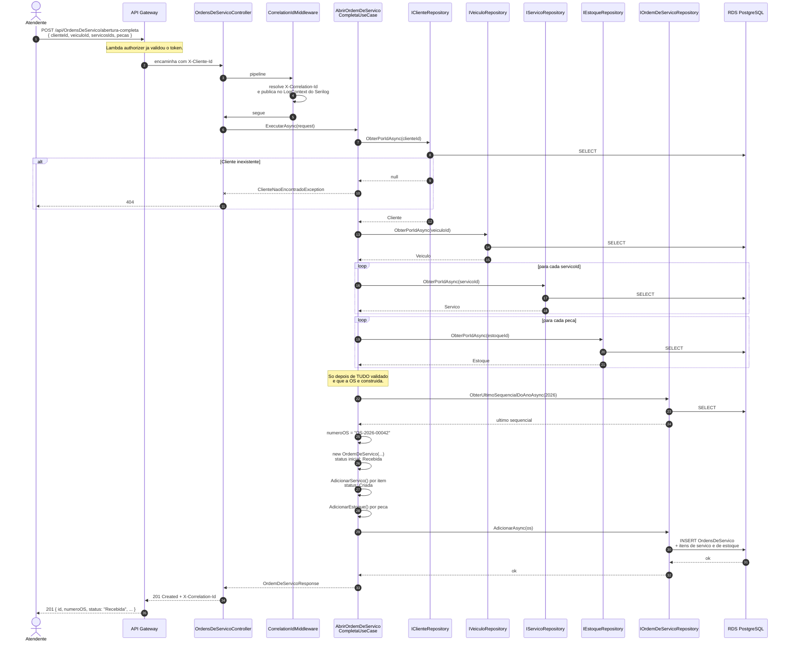
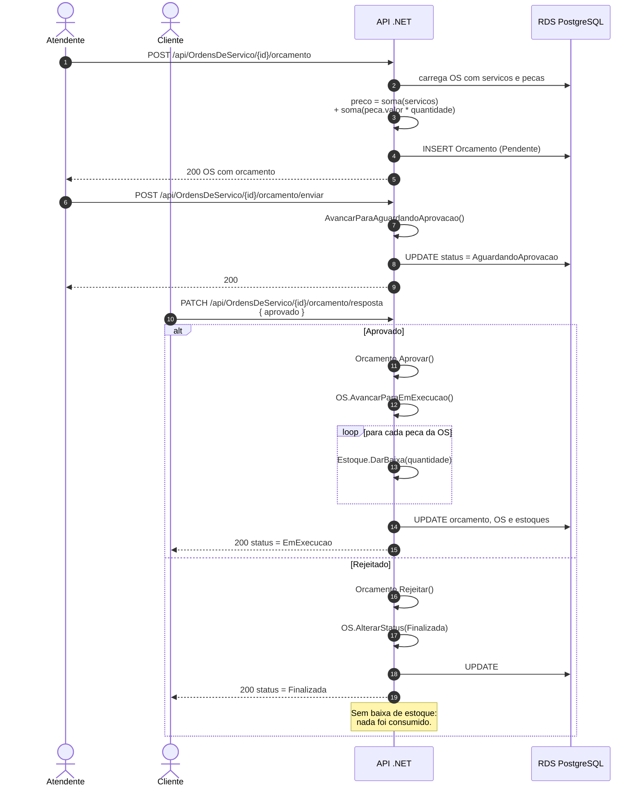
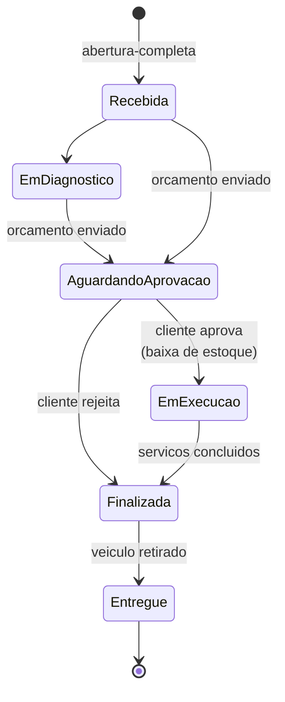
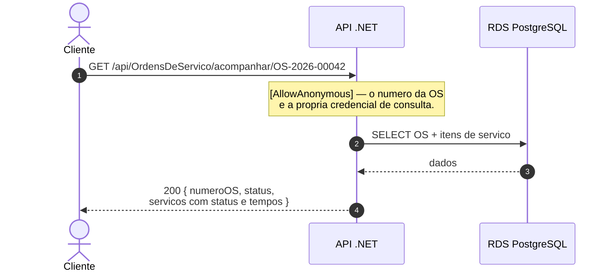

# Diagrama de Sequência — Abertura de Ordem de Serviço

O caminho de uma OS, da abertura ao acompanhamento pelo cliente.

Rota principal: `POST /api/OrdensDeServico/abertura-completa` (requer autenticação).

---

## 1. Abertura da OS

**Pontos que valem a leitura**

- **Validação antes de construir.** Cliente, veículo, todos os serviços e todas as peças são verificados **antes** de a OS ser instanciada. Nenhuma OS parcial chega ao banco.
- **Numeração legível.** `OS-2026-00042` vem do último sequencial do ano mais um. Depende de leitura consistente — uma das razões da escolha de um banco relacional ([RFC 0002](../rfcs/0002-escolha-banco-de-dados.md)).
- **Correlation ID em tudo.** Publicado no `LogContext` do Serilog, ele aparece automaticamente em toda linha de log da requisição, e volta ao chamador no header `X-Correlation-Id`.
- **Baixa de estoque não acontece aqui.** As peças ficam apenas *vinculadas*; a baixa só ocorre quando o orçamento é aprovado.

---

## 2. Orçamento, aprovação e execução

**Ponto que vale a leitura:** a **baixa de estoque só ocorre na aprovação**. É o momento em que a peça deixa de estar reservada e passa a estar consumida — e é por isso que a operação é uma transação única com a mudança de status.

---

## 3. Ciclo de vida do status

Cada item de serviço dentro da OS tem seu **próprio** ciclo — `Criada` → `Iniciado` → `Finalizado` —, com `IniciadaEm` e `FinalizadaEm` registrados. São esses timestamps que alimentam o cálculo de aging (`GET /api/OrdensDeServico/aging`) e o dashboard de tempo médio por status ([RFC 0004](../rfcs/0004-ferramenta-de-observabilidade.md)).

---

## 4. Acompanhamento público pelo cliente

Esta rota é intencionalmente pública: o cliente acompanha a própria OS pelo número, sem login. As rotas de **escrita** e de listagem geral continuam protegidas — pelo Lambda authorizer no gateway e pelo `[Authorize]` na aplicação.

---

## Documentos relacionados

- [Diagrama ER](modelo-er.md)
- [Diagrama de sequência — autenticação](sequencia-autenticacao.md)
- [Diagrama de componentes](componentes.md)
