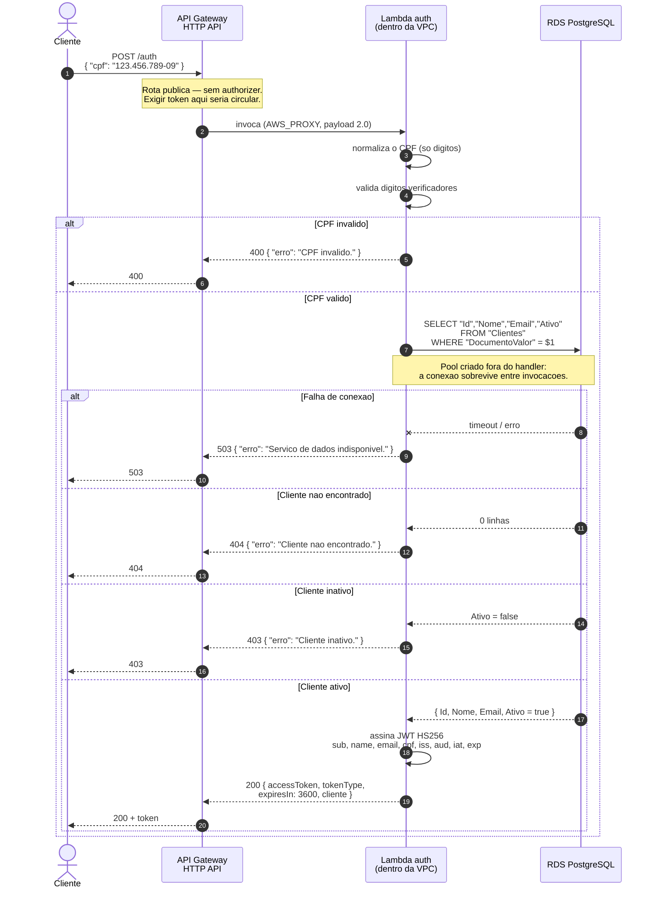
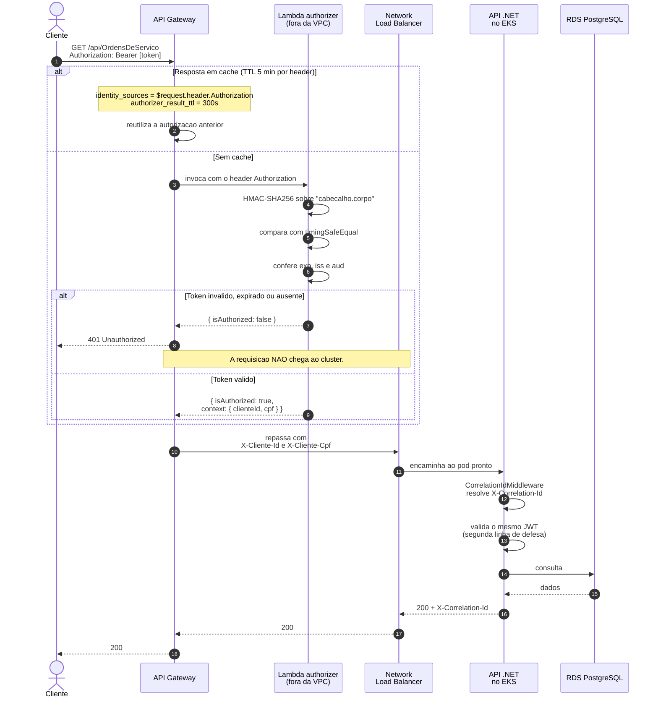
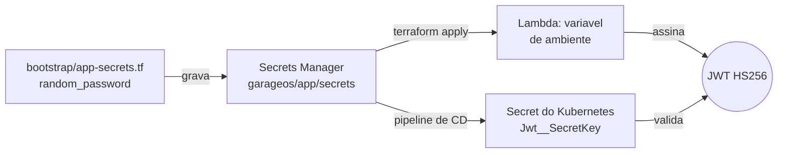

# Diagrama de Sequência — Fluxo de Autenticação

Como o cliente troca um CPF por um token, e como esse token é verificado nas requisições seguintes.

Decisões por trás deste fluxo: [RFC 0003 — Estratégia de Autenticação](../rfcs/0003-estrategia-de-autenticacao.md).

---

## 1. Obtenção do token (`POST /auth`)

**Pontos que valem a leitura**

- A validação de CPF acontece **antes** de tocar no banco: evita consulta desnecessária e devolve `400` em vez de `404`. Rejeita também os 11 dígitos iguais, que passam no cálculo dos verificadores mas não são CPF real.
- A chave de assinatura vem do **AWS Secrets Manager**, injetada como variável de ambiente no `terraform apply`. A Lambda está em subnet privada e não há NAT Gateway, então ela não alcançaria a API do Secrets Manager em tempo de execução.
- Cada cenário tem um código HTTP próprio — `400`, `403`, `404` e `503` dizem coisas diferentes a quem consome.

---

## 2. Uso do token em rota protegida

**Pontos que valem a leitura**

- O authorizer é do tipo **REQUEST**, não JWT nativo. O authorizer JWT do HTTP API exige um provedor OIDC/OAuth2 que exponha JWKS; um token HS256 não tem chave pública para o gateway buscar.
- Ele roda **fora da VPC** de propósito: só confere uma assinatura HMAC, não toca no banco. Sem ENI para criar, o cold start é muito menor — e ele roda em toda requisição protegida.
- A comparação usa `crypto.timingSafeEqual`. Uma comparação com `===` sai no primeiro byte diferente, e medir esse tempo permite descobrir a assinatura byte a byte.
- A identidade extraída do token viaja como header (`X-Cliente-Id`, `X-Cliente-Cpf`), então a aplicação não precisa decodificar o JWT de novo.
- A API .NET **também** valida o token. Redundante por segurança: o NLB é `internet-facing` e continua acessível sem passar pelo gateway.

---

## 3. A chave compartilhada

`JWT_SECRET_KEY`, `JWT_ISSUER` e `JWT_AUDIENCE` saem do **mesmo segredo**. É isso que impede o modo de falha silencioso: se os dois lados divergirem, a API rejeita **todo** token emitido pela Lambda — sem erro claro, sem log útil, só 401 em tudo.

O segredo vive no *bootstrap*, e não no repositório do banco, porque destruir o banco não pode invalidar todos os tokens em circulação.

---

## Documentos relacionados

- [RFC 0003 — Estratégia de Autenticação](../rfcs/0003-estrategia-de-autenticacao.md)
- [Diagrama de componentes](componentes.md)
- [Diagrama de sequência — abertura de OS](sequencia-abertura-os.md)
