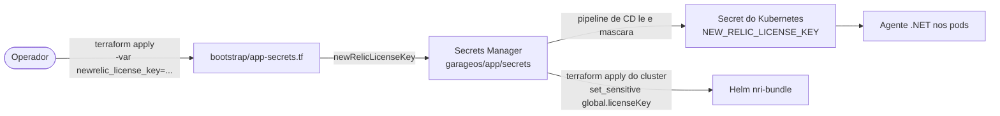

# RFC 0004 — Ferramenta de Observabilidade

| | |
|---|---|
| **Status** | Aceito |
| **Data** | 2026-08-27 |
| **Autores** | Equipe GarageOS (Tech Challenge — Fase 3) |
| **Repositórios afetados** | `garageos-app`, `garageos-infra-k8s` |
| **Relacionadas** | [RFC 0001](0001-escolha-provedor-cloud.md), [ADR 0002](../adrs/0002-uso-do-hpa.md) |

## Contexto

A RFC 0001 deixou em aberto qual ferramenta de observabilidade adotar, registrando apenas que a escolha ficaria entre Datadog e New Relic. A Fase 3 exige:

- monitoramento da aplicação e do cluster;
- **dashboards de negócio** — volume diário de ordens de serviço, tempo médio por status e erros de integração;
- **alertas** para falhas no processamento de ordens de serviço.

O ponto que restringe a escolha: *dashboards de negócio não são coletáveis por infraestrutura*. Nenhuma ferramenta consegue mostrar "volume diário de OS" observando CPU e memória — a métrica precisa ser **emitida pela própria aplicação**. Portanto, a ferramenta escolhida precisa aceitar bem três tipos distintos de sinal: métricas de infraestrutura, logs da aplicação e métricas/eventos de negócio customizados.

## Problema

Qual ferramenta de observabilidade adotar para cobrir, com uma peça só, as métricas do cluster Kubernetes, os logs estruturados da API, o tracing distribuído e as métricas de negócio — dentro do orçamento de créditos e sem exigir infraestrutura própria de coleta?

## Opções consideradas

| Opção | A favor | Contra |
|---|---|---|
| **New Relic** | Free tier permanente de 100 GB/mês de ingestão e 1 usuário full — não consome os créditos AWS; agente .NET que instrumenta ASP.NET Core, EF Core e Npgsql **sem uma linha de código de tracing**; chart Helm oficial para Kubernetes; log, métrica, trace e alerta na mesma interface, correlacionados por `trace.id` | Vendor lock-in na NRQL; free tier limitado a 1 usuário full |
| **Datadog** | Excelente cobertura de Kubernetes e APM maduro | Trial de 14 dias e depois cobrança por host (~US$ 15/host/mês). Com 2 nós, custo real durante toda a fase. O período de trial poderia expirar antes da entrega |
| **Amazon CloudWatch** | Nativo, sem agente extra, integrado ao IAM | Custo por métrica customizada (US$ 0,30/métrica/mês) sobre os créditos AWS; dashboards e correlação log↔trace bem mais pobres; instrumentação .NET exigiria ADOT |
| **Prometheus + Grafana + Loki (self-hosted)** | Sem custo de licença; padrão de mercado | Precisaria rodar no cluster: mais pods, mais nós, mais custo de EC2, mais coisa para manter. Retenção exigiria volume persistente. Ironicamente, a stack de observabilidade viraria o maior risco operacional do projeto |

## Decisão

Adotar o **New Relic** como plataforma única de observabilidade, com três pontos de coleta:

| Ponto | Como | O que coleta |
|---|---|---|
| **Aplicação (.NET)** | Agente copiado da imagem `newrelic/newrelic-dotnet-init` no Dockerfile, atuando como profiler do CLR (`CORECLR_*`) | APM: latência por endpoint, throughput, taxa de erro, consultas do EF Core/Npgsql, traces distribuídos |
| **Cluster (EKS)** | Chart Helm `nri-bundle`, release `newrelic-bundle` no namespace `newrelic`, instalado pelo `garageos-infra-k8s` (`newrelic.tf`) | CPU, memória, disco e rede de nós, pods e containers; estado dos objetos do Kubernetes |
| **Logs** | `NEW_RELIC_APPLICATION_LOGGING_FORWARDING_ENABLED=true` no próprio agente .NET | Linhas JSON do Serilog, com `trace.id` e `span.id` injetados |
| **Negócio** | Custom events emitidos pelos use cases via `IMetricasDeNegocio` | Abertura de OS, transição de status com duração, falha no processamento |

### Por que o agente como profiler, e não uma biblioteca

O agente instrumenta ASP.NET Core, Entity Framework Core e Npgsql automaticamente, sem nenhuma chamada de tracing no código da aplicação. Ele é copiado da imagem oficial em vez de instalado via `apt` — assim não entra repositório extra, chave GPG nem `apt-get update` inflando a imagem.

`NEW_RELIC_LICENSE_KEY` e `NEW_RELIC_APP_NAME` **não entram na imagem**: a chave é segredo e viria junto em qualquer `docker push`. Vêm do ambiente — `.env` no local, Secret e ConfigMap do Kubernetes no cluster.

### O caminho da license key

A chave é o único segredo do projeto que **não pode ser sorteado**: ela é emitida pela New Relic e identifica a conta para onde os dados vão. Entra uma vez, como variável do bootstrap, e é guardada no mesmo segredo dos demais para que exista um único lugar de onde tudo é lido.



A mesma chave serve aos dois agentes — o do CLR dentro dos pods e o do cluster. `NEW_RELIC_APP_NAME` fica no ConfigMap (`garageOS`), porque não é segredo e precisa ser diferente do nome usado no `docker compose` local, para que dados de desenvolvimento não se misturem aos do cluster.

Deixar a variável vazia desabilita o envio: o agente sobe, registra *"Please set your license key"* e se desliga, e a aplicação continua funcionando normalmente. É o que permite rodar o ambiente local sem nenhuma configuração de observabilidade.

### O que do `nri-bundle` ficou ligado, e por quê

O `nri-bundle` é um chart guarda-chuva. Ligar o pacote inteiro derrubaria pods: cada nó `t3.small` tem cerca de 1,4 GB alocável e já opera perto de 56% só com a aplicação.

| Componente | Estado | Motivo |
|---|---|---|
| `infrastructure` | **ligado** | É o coletor de CPU, memória, disco e rede — o que atende ao requisito |
| `kube-state-metrics` | **ligado** | Traduz Deployment, HPA e Job em métricas. Sem ele não há "2 de 4 réplicas prontas", só contagem de containers |
| `webhook` | **ligado** | Injeta identificadores do cluster nos pods, ligando cada transação do APM ao pod e ao nó que a atendeu |
| `logging` | desligado | Os logs **já** são encaminhados pelo agente .NET, com `trace.id` por linha. Ligar aqui duplicaria dado e ingestão |
| `newrelic-pixie` / `pixie-chart` | desligado | Continuous profiling: memória demais para `t3.small` |
| `prometheus` | desligado | Não há Prometheus no cluster para raspar |
| `nri-kube-events` | desligado | Útil, mas não é requisito, e custa ingestão |

`global.lowDataMode = true` coleta as métricas essenciais e descarta as de granularidade fina. Sem isso, um cluster pequeno consome a cota de 100 GB/mês do free tier em poucos dias.

### Correlação ponta a ponta

O `CorrelationIdMiddleware` publica o `X-Correlation-Id` no `LogContext` do Serilog, então toda linha de log emitida durante a requisição o carrega automaticamente. O header é reaproveitado quando o chamador já o envia — é isso que permite seguir uma operação que atravessa API Gateway, Lambda e API. Em paralelo, o agente injeta `trace.id` e `span.id` em cada linha, ligando **log a trace** na interface.

Resultado prático: dado um `X-Correlation-Id` devolvido ao cliente, é possível recuperar todas as linhas de log da requisição e o trace correspondente, com as consultas SQL que ela executou.

### Métricas de negócio

Esta é a única parte que **depende de instrumentação explícita na aplicação** — a ferramenta só coleta o que a API emitir. Quanto tempo uma OS permaneceu em diagnóstico é dado do domínio: nenhuma ferramenta deduz isso de latência de requisição.

A publicação passa pela interface `IMetricasDeNegocio`, declarada em `GarageOS.Application/Abstractions` e implementada por `MetricasNewRelic` na Infrastructure. Os use cases não conhecem o fornecedor — trocar de ferramenta não toca em regra de negócio.

**Custom events, e não métricas.** Eventos permitem consultar por NRQL com `FACET` e agregação arbitrária *depois* do fato; uma métrica exigiria decidir a agregação na emissão. Como os dashboards ainda podiam mudar de recorte, a decisão foi manter o dado bruto.

#### Eventos emitidos

| Evento | Atributos | Emitido em |
|---|---|---|
| `OrdemDeServicoCriada` | `numeroOS`, `clienteId` | `AbrirOrdemDeServicoCompletaUseCase`, após a persistência |
| `OrdemDeServicoStatus` | `numeroOS`, `statusAnterior`, `statusNovo`, `minutosNoStatus` | `AlterarStatusOrdemDeServicoUseCase` |
| `OrdemDeServicoFalha` | `numeroOS`, `motivo` | Três pontos: `OrdensDeServicoController` (transição de status recusada pela validação), `AbrirOrdemDeServicoCompletaUseCase` e `AlterarStatusOrdemDeServicoUseCase` (exceções de domínio) |

Duas decisões de implementação valem registro:

- **`minutosNoStatus` é calculado antes da transição.** Depois de `AlterarStatus()`, o estado anterior não existe mais em lugar nenhum: a duração vem de `DateTime.UtcNow - AtualizadoEm`, capturada antes da mudança.
- **Nenhuma chamada de telemetria lança exceção.** Falha ao registrar vira `LogDebug` e a operação segue. Observabilidade quebrada não pode derrubar uma ordem de serviço — e é isso que permite rodar a aplicação localmente, sem agente, sem nenhum tratamento especial.

#### Dashboards e o alerta

Os três dashboards exigidos e o alerta são montados na interface do New Relic sobre os eventos acima e sobre os dados de APM. As consultas ficam registradas aqui como a referência do que cada painel mede.

| Dashboard exigido | NRQL |
|---|---|
| Volume diário de ordens de serviço | `SELECT count(*) FROM OrdemDeServicoCriada SINCE 7 days ago TIMESERIES 1 day` |
| Tempo médio por status | `SELECT average(minutosNoStatus) FROM OrdemDeServicoStatus FACET statusAnterior SINCE 7 days ago` |
| Erros de integração | `SELECT count(*) FROM TransactionError WHERE appName = 'garageOS' FACET error.message TIMESERIES` |

O alerta obrigatório — **falhas no processamento de ordens de serviço** — é uma condição NRQL sobre o **evento de negócio**, não sobre a exceção técnica:

```sql
SELECT count(*) FROM OrdemDeServicoFalha
```

| Parâmetro da condição | Valor |
|---|---|
| Nome | Falhas no processamento de ordens de serviço |
| Janela de agregação | 1 minuto, método `EVENT_FLOW`, atraso de 120 s |
| Limite crítico | `above 0` por pelo menos 1 minuto |
| Notificação | *workflow* ligado a um destino de e-mail |

**Por que sobre `OrdemDeServicoFalha`, e não sobre `TransactionError`.** Nem toda falha de processamento vira exceção. A recusa de uma transição de status inválida é uma resposta `400` deliberada, produzida pela validação antes de o caso de uso rodar — ela nunca sobe até o `ExceptionMiddleware` e, portanto, **não gera `TransactionError` nenhum**. Um alerta ancorado na exceção técnica seria cego justamente para o caso mais comum. O evento de negócio é emitido explicitamente nos três pontos onde uma OS deixa de ser processada, então cobre tanto a exceção quanto a rejeição validada.

O `TransactionError` continua alimentando o **dashboard** de erros de integração, onde o recorte desejado é por `error.message` — ali o que interessa é a falha técnica.

> **Validado em cenário controlado.** Uma sequência de transições de status recusadas gerou o incidente correspondente em `NrAiIncident`, com o `Degradation Time` apontando para o minuto das primeiras falhas, e o e-mail chegou ao destinatário do workflow. A verificação é reproduzível por NRQL: `SELECT * FROM NrAiIncident SINCE 2 hours ago` mostra o incidente aberto pela condição, e `SELECT count(*) FROM OrdemDeServicoFalha TIMESERIES 1 minute` mostra o sinal que o disparou.

## Consequências

**Positivas**

- Custo zero durante toda a fase: o free tier de 100 GB/mês é folgado para dois nós e uma API.
- Não consome os créditos AWS, que ficam integralmente para EKS, RDS e demais serviços.
- Log, métrica, trace e alerta na mesma ferramenta, correlacionados — sem precisar cruzar interfaces diferentes na hora do incidente.
- Instrumentação de APM sem código: o agente cobre framework, ORM e driver do banco automaticamente.
- As métricas de negócio ficam atrás de uma interface na camada de Application, então os use cases não conhecem o fornecedor — o lock-in fica confinado a uma classe da Infrastructure.
- Telemetria não derruba operação: nenhuma chamada de métrica propaga exceção, e a ausência da license key apenas desliga o envio.

**Trade-offs conscientes**

- **Vendor lock-in na NRQL.** Dashboards e alertas são escritos na linguagem do New Relic. O lock-in fica contido: os *sinais* emitidos pela aplicação — logs JSON e custom events — são portáveis, e a emissão está atrás da interface `IMetricasDeNegocio`, então trocar de ferramenta significa reescrever uma classe da Infrastructure.
- **Dimensionamento do cluster define o que é coletado.** Cada `t3.small` tem ~1,4 GB alocável e opera perto de 56% com a aplicação no ar. Foi essa medição que definiu o conjunto de componentes do `nri-bundle` ligados: `infrastructure`, `kube-state-metrics` e `webhook` cobrem o requisito de CPU e memória; os demais entram junto com um tipo de instância maior.
- **Free tier de 1 usuário full.** Os demais integrantes acessam como usuários básicos, o que atende ao uso do projeto e à demonstração.
- **Dados de telemetria fora da AWS.** Logs e métricas trafegam para a New Relic, e os custom events carregam `clienteId` e `numeroOS`. Em um cenário com dados pessoais reais, o passo seguinte seria mascaramento na origem, sob avaliação de LGPD.
- **Observabilidade das Lambdas pelo CloudWatch.** `garageos-lambda-auth` e o log de acesso do API Gateway reportam para o CloudWatch Logs, com retenção de 7 dias — a Lambda de autenticação está em subnet privada sem NAT, e o CloudWatch a alcança sem exigir rota de saída.

## Referências

- Implementação da aplicação: `Dockerfile` (agente), `Code/GarageOS.Api/Program.cs` (Serilog), `Code/GarageOS.Api/Middlewares/CorrelationIdMiddleware.cs`, `Code/GarageOS.Application/Abstractions/IMetricasDeNegocio.cs`, `Code/GarageOS.Infrastructure/Observabilidade/MetricasNewRelic.cs`
- Implementação da infraestrutura: `garageos-infra-k8s/newrelic.tf`, `garageos-infra-database/bootstrap/app-secrets.tf`
- [Diagrama de componentes](../diagramas/componentes.md)
- Enunciado do Tech Challenge — Fase 3, requisitos de monitoramento, dashboards e alertas
